Love Archery

  

[Click Here To Visit Live Site]( https://maireadkelly.github.io/Project1/)

## Design & Planning:

###User Stories
 -As a user I want to be able to navigate the site easily
 -I want to be able find out when and where it's on
 -I want to be able to sign up for a class

### Wireframes
Attach wireframes in this section

### Typography
I used google font types K2D, Lato and Oswald fonts.  I chose these fontsbecause I find they are easy to read while still being stylish.
I used https://fonts.google.com/ to pick my fonts.

### Colour Scheme
rgb(241, 109 , 147, .7) light pink transparent used for cover text background
#5a738e Dark Blue used for header.
#3a3a3a Very Dark Grey used for Social Network links in footer
#dca5b1 Very Soft Red used as main background color
#ffeb99 Very Light Yellow used for headings text
#d1b1c8 used for "Lets Shoot" button
I chose these colors as they contrast well for ease of reading, as well as being pleaing to the eye. 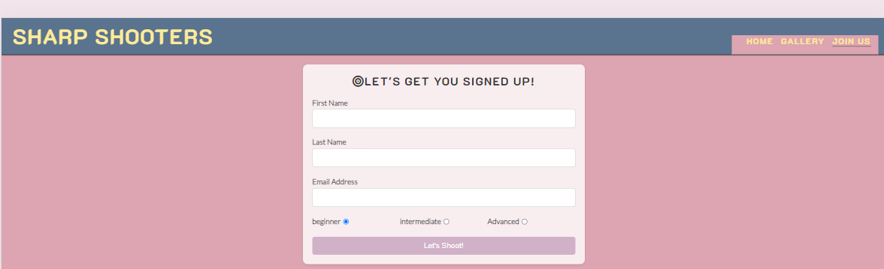

## Features:
### Navigation
The navigation bar is fixed to the top of the screen and has active links to the gallery and join us form pages.
The Sharp Shooters text, on the left side of the navigation bar, is linked to the home page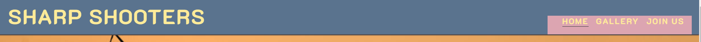

### Header
The header has a hero image of an archer taking aim with a golden sunset in the background.  It also has the club name and location superimposed on the image.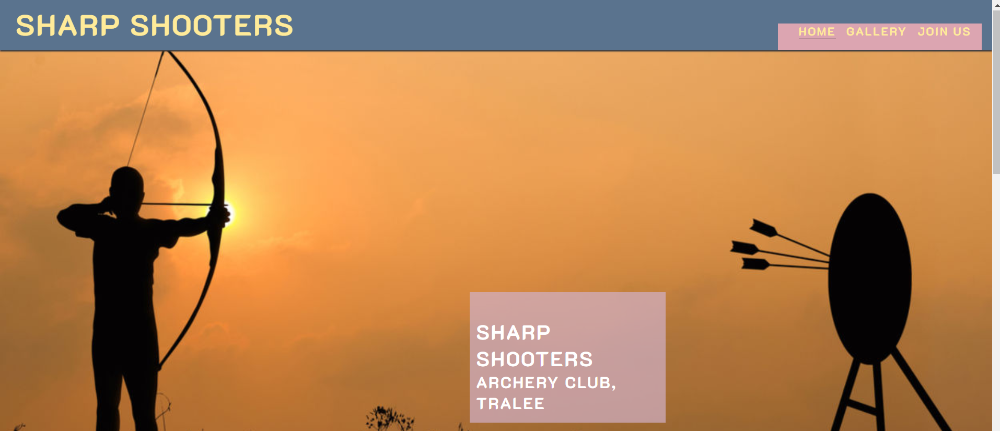

### Benefits:
I have included an overall view of the benefits (both physical and mental) of archery.

### Meetup Times
Information on times that our varoius level meet each week.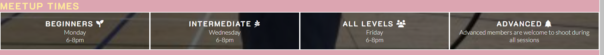

### Gallery
In the gallery I wanted to show that archery is a sport that is suitable for people of all ages and abilities.  That it can be enjoyed as a recreational, and social outlet, but also has a competitive aspect for those who prefer more of a challenge, from local and national competitions to Olympic and Paralympic levels.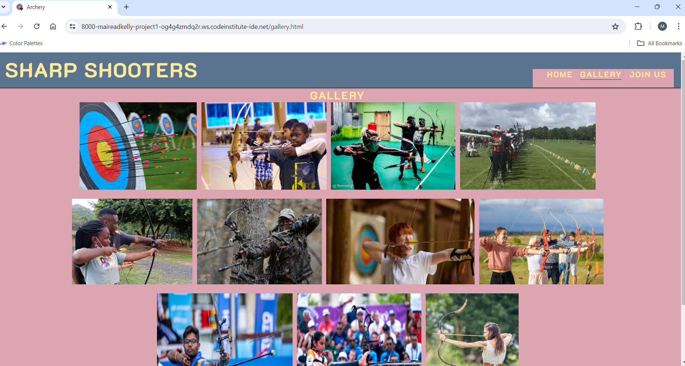

### Footer
The footer has navigetion links to the most popular social media sites, namely
Facebook, Twitter, Instagram and YouTube

## Future features
In the future I would like to add some features to make it possible for people to sign up online, not just request someone to contact them.
I would also like to introduce the ability for beginners to pay for their course online and save the need for them to bring money to their first class.  Another feature would to make it possible for current members to renew their membership online.

## Technologies Used
- HTML5 
- CSS3

 ### Frameworks, Libraries & Programes Used
- #### [Google fonts](https://fonts.google.com/knowledge)
Google fonts were used to import the ***'Dosis'*** font into the style.css file which is used on all pages throughout the project
 - #### [Font Awesome](https://fontawesome.com/)
Font Awesome was used on all pages throughout the website to add icons for aesthetic and UX purposes.
 - #### [Git](https://gitpod.io/)
Git was used for version control by utilizing the Gitpod terminal to commit to Git and Push to GitHub.
  - #### [GitHub](https://github.com/)
GitHub is used to store the projects code after being pushed from Git.
ChatGPT was used to help resolve issues arising while styling the gallery in particular

## Testing
I tested compatability on the following browsers:
Google Chrome ()
### Google's Lighthouse Performance
![mobile]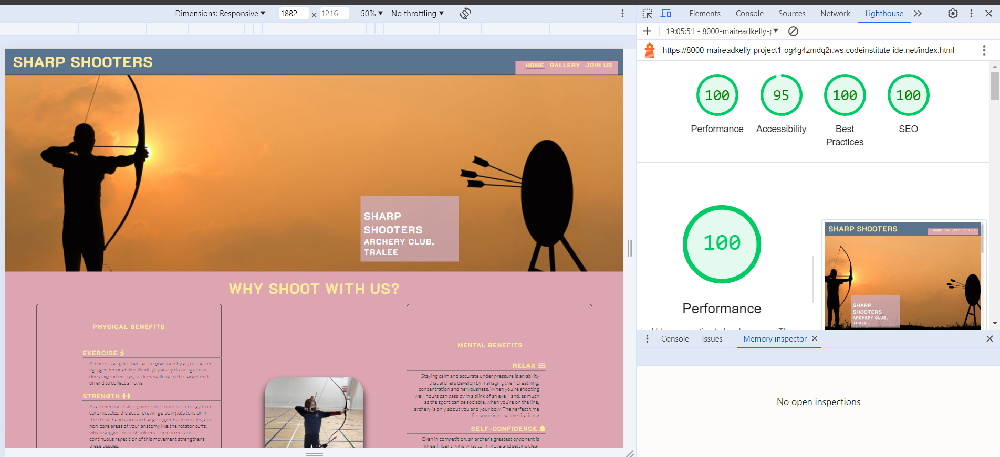
![desktop]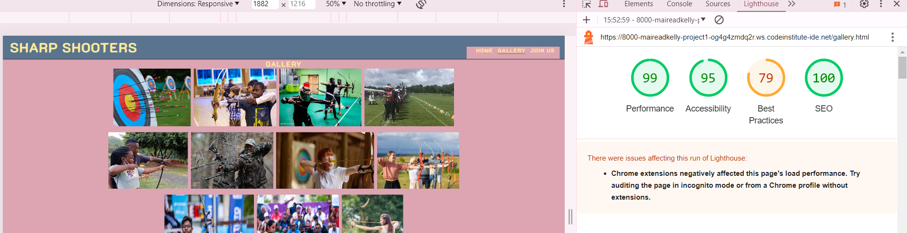
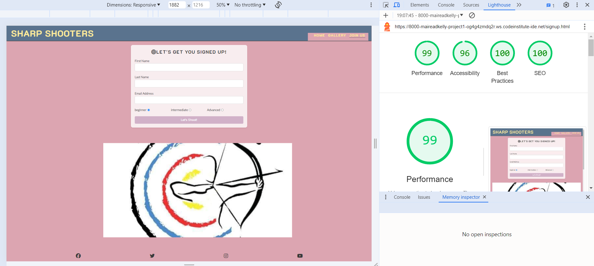

### Browser Compatibility
Compatability was tested with the following browsers
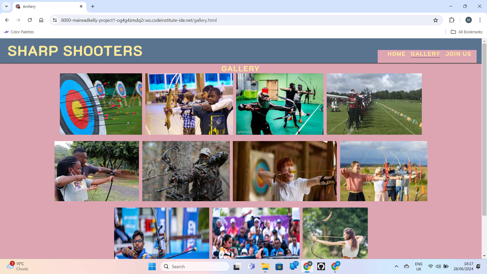
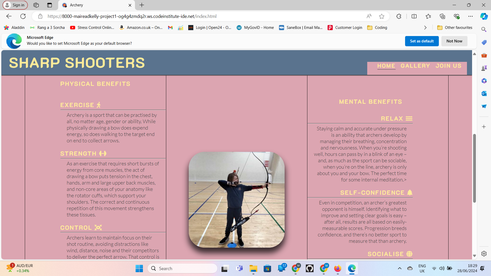
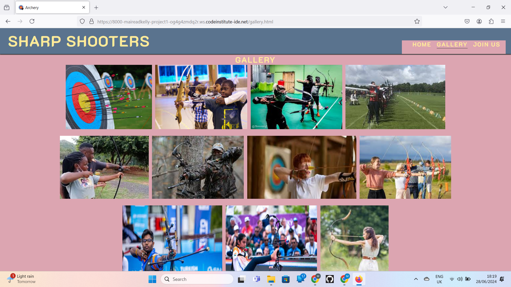
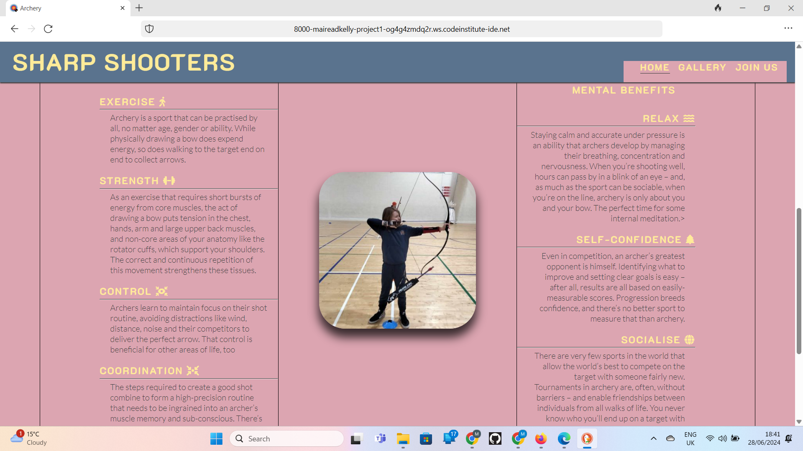

### Responsiveness
Screenshots of the responsivness, 
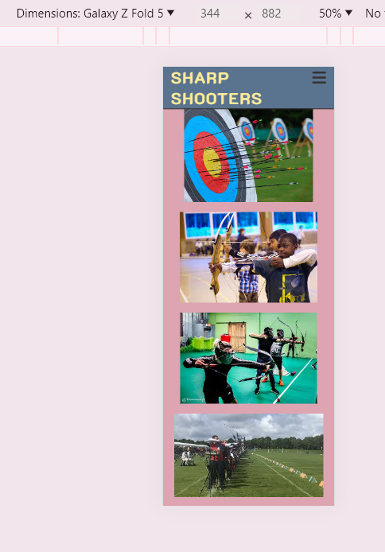
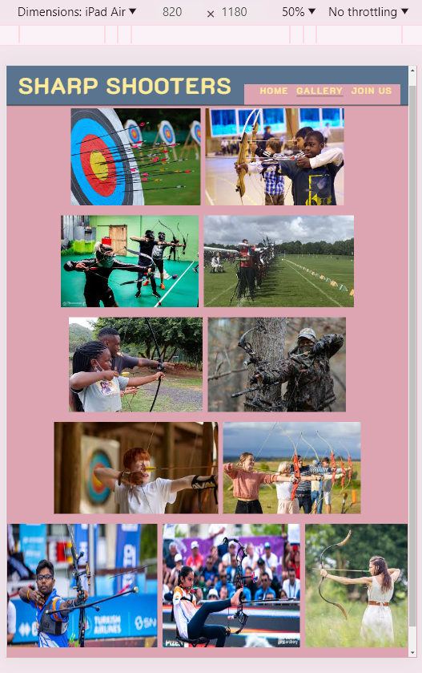
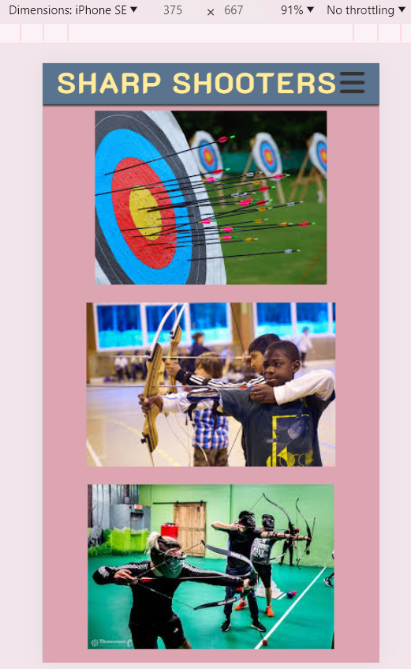

### Code Validation
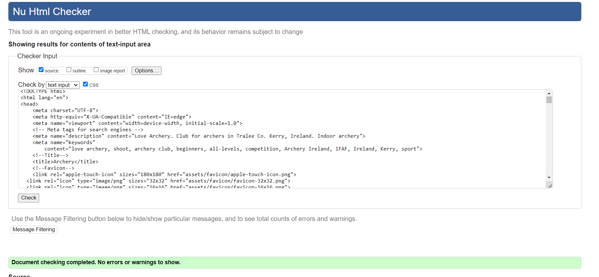
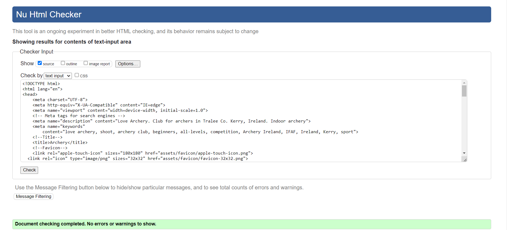
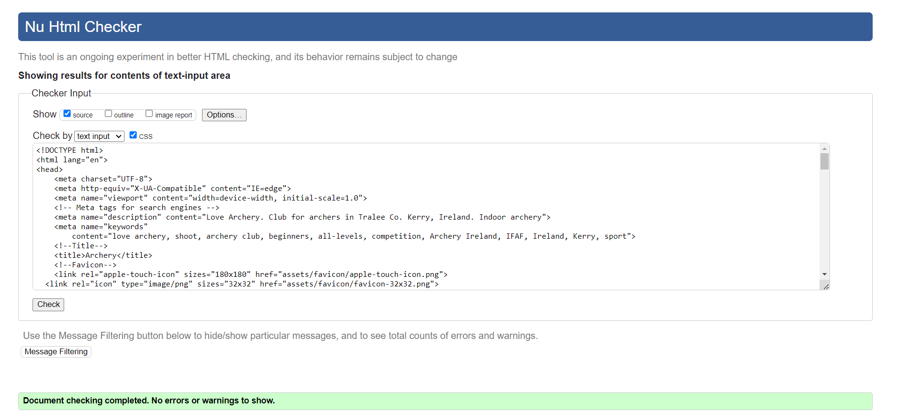
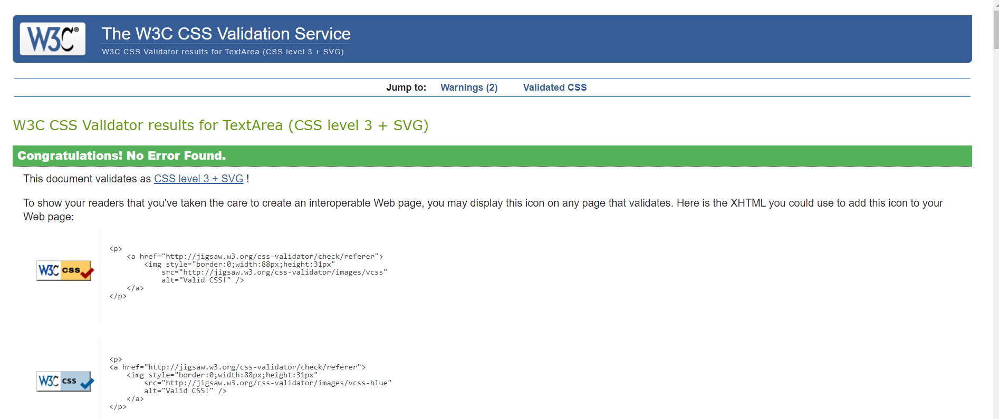

### Testing user stories
###User Stories
 -As a user I want to be able to navigate the site easily
 -I want to be able find out when and where it's on
 -I want to be able to sign up for a class

Test all your user stories, you an create table 
User Story |  Test | Pass
--- | --- | :---:
paste here you user story | what is visible to the user and what action they should perform | &check;
- and attach screenshot

## Bugs
List of bugs and how did you fix them

## Deployment
- Github pages
    - This project was deployed to GitHub Pages using the following steps
      - Log in to GitHub and locate the GitHub Repository
      - At the top of the Repository (not top of page), locate the "Settings" Button on 
        the menu.
      - Scroll down the Settings page until you locate the "GitHub Pages" Section.
      - Under "Source", click the dropdown called "None" and select "Master Branch".
      - The page will automatically refresh.
      - Scroll back down through the page to locate the now published site link in the "GitHub Pages" section.
      - live link for the page can be found here [Project1](https://maireadkelly.github.io/Project1/index.html)
- Forking the GitHub Repository
    - By forking the GitHub Repository we make a copy of the original repository on our GitHub account to view and/or make changes without affecting the original repository by using the following steps
     - Log in to GitHub and locate the GitHub Repository
     - At the top of the Repository (not top of page) just above the "Settings" Button on the menu, locate the "Fork" Button.
     - You should now have a copy of the original repository in your GitHub account.
- Making a Local Clone
   - Log in to GitHub and locate the GitHub Repository
   - Under the repository name, click "Clone or download".
   -  To clone the repository using HTTPS, under "Clone with HTTPS", copy the link.
   - Open Git Bash
   - Change the current working directory to the location where you want the cloned directory to be made
   - Type git clone, and then paste the URL you copied in Step 3.
      - $ git clone https://github.com/YOUR-USERNAME/YOUR-REPOSITORY
   - Press Enter. Your local clone will be created.

   ## Credits
  I got my code from a number of sources such as the love running project.  I also used resources such as W3Schools and google, along with help from fellow classmates and chatGPT.  I got my main inspiration from the love running project. Content from web sites such as https://archerygb.org/ and images through google searches.

   ## Acknowledgments
  